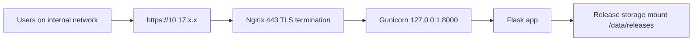

# Hosted Portal Deployment Guide

## Architecture

## Port and Network Model

- Public ingress: `443/tcp` on the internal VM (`10.17.x.x`)
- Optional redirect ingress: `80/tcp` to HTTPS
- Internal app listener: Gunicorn on `127.0.0.1:8000`
- Flask is not exposed directly to users.

## Required Environment Variables

- `HOSTED_PORTAL_ENV`
- `HOSTED_PORTAL_HOST`
- `HOSTED_PORTAL_PORT`
- `HOSTED_PORTAL_BASE_URL`
- `HOSTED_PORTAL_RELEASE_ROOT`
- `HOSTED_PORTAL_CACHE_DIR`
- `HOSTED_PORTAL_LOG_LEVEL`
- `HOSTED_PORTAL_GUNICORN_BIND`
- `HOSTED_PORTAL_GUNICORN_WORKERS`
- `HOSTED_PORTAL_GUNICORN_THREADS`

Reference examples:

- `.env.development`
- `.env.production`

## Deployment Steps (Production VM)

1. Place code under `/opt/hosted-docking-portal`.
2. Create a Python environment and install dependencies.
3. Set environment using `.env.production` values.
4. Configure systemd from `deploy/hosted-portal.service.template`.
5. Configure Nginx from `deploy/nginx_hosted_portal.conf.template`.
6. Place TLS certificate and key in `/etc/nginx/certs/`.
7. Start Gunicorn systemd service.
8. Reload and start Nginx.
9. Confirm `https://10.17.x.x/` and `/api/health` are reachable.

## Reverse Proxy and URL Generation

- Flask uses `ProxyFix` for `X-Forwarded-*` headers.
- URL generation is derived from `HOSTED_PORTAL_BASE_URL` and proxy metadata.
- Templates use configuration-aware URL helpers rather than hardcoded localhost links.

## Validation Checklist

1. Start Gunicorn service.
2. Start or reload Nginx.
3. Open `https://10.17.x.x` from the VM itself.
4. Open `https://10.17.x.x` from a second machine on the internal network.
5. Confirm release list loads.
6. Confirm release selection opens `/dataset/<release_id>`.
7. Confirm scaffold and molecule APIs return JSON.
8. Confirm no `localhost` or `127.0.0.1` appears in rendered page source URLs.
9. Confirm static assets load from local `/static/vendor/` paths.
10. Confirm report payload route renders and iframe loads.

## Troubleshooting

- `Flask CLI no such option --app`: use `FLASK_APP=wsgi:app python -m flask run ...`.
- Release list empty: verify `HOSTED_PORTAL_RELEASE_ROOT` and manifest validity.
- Blank 3D or charts: current vendored assets are compatibility shims; replace with full upstream local libraries.
- Wrong links or redirects: verify `HOSTED_PORTAL_BASE_URL` and Nginx forwarded headers.

## Firewall Notes

- Open `443/tcp` inbound on the VM security policy.
- Keep `8000/tcp` closed externally; Gunicorn is localhost-bound.
