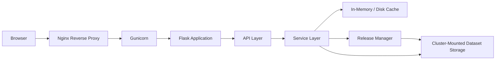
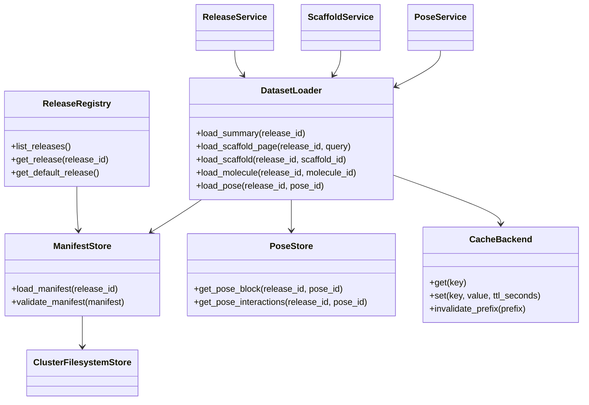

# Hosted Docking Portal Technical Design

## 1. Scope and Design Constraints

This document defines a production-ready architecture for converting the current static docking report workflow into a hosted, reusable, read-only web application for structure-based drug design programs.

The design is grounded in the current implementation:

- Data production is centered in `process_docking_IF_show_docking.py`.
- HTML assembly and most UI behavior are emitted from `report_helpers.py`.
- 3D pose viewing is emitted from `docking_pose_visualizer_block.py`.
- Ranking, filtering, and scaffold summarization already exist and should be reused rather than rewritten from scratch.

Phase 1 assumptions confirmed for this design:

- Deployment target: single internal Linux host.
- Traffic: 1 to 10 active users.
- Dataset size: roughly 5,000 to 20,000 poses and 100 to 1,000 scaffolds.
- Releases are published manually from the existing Python pipeline.
- Storage is a cluster-mounted filesystem.
- The application is read-only for end users.
- No outbound internet should be required in production.
- Users must be able to switch among multiple published releases.
- The hosted UI should be as close as practical to the current generated HTML report.

## 2. Target Architecture

### 2.1 Logical Architecture



### 2.2 Runtime Responsibilities

**Browser**

- Serves as the interactive client for scaffold exploration, molecule review, property filtering, and 3D pose inspection.
- Loads a thin HTML shell plus static CSS and JavaScript assets.
- Fetches release-specific data through JSON APIs.
- Renders charts, tables, filter chips, and 3D viewer state locally.
- Stores non-scientific UI state in browser storage, such as selected filters, starred scaffolds, and panel state.

**Nginx**

- Terminates HTTP connections on the internal network.
- Serves static assets directly: CSS, JavaScript, images, vendored 3Dmol, vendored RDKit JS/WASM, favicon, downloaded bundle endpoints if desired.
- Proxies dynamic requests to Gunicorn.
- Applies request limits, security headers, gzip or brotli compression, and access logging.
- Optionally exposes a simple health endpoint without traversing all app logic.

**Gunicorn**

- Hosts the Flask WSGI application.
- Manages multiple worker processes for concurrent read-only API access.
- Provides process isolation from Nginx and restarts failed workers.

**Flask Application**

- Serves page routes and REST APIs.
- Resolves the active release from the URL or query context.
- Hydrates initial HTML with minimal metadata, then delegates bulk data loading to JSON endpoints.
- Enforces read-only access and request validation.

**API Layer**

- Exposes typed JSON endpoints for releases, scaffolds, molecules, filters, statistics, and poses.
- Provides stable contracts independent of the underlying CSV and SDF artifacts.
- Normalizes pagination, sorting, filtering, and error responses.

**Service Layer**

- Implements business logic currently spread across report generation code.
- Translates release artifacts into API-ready objects.
- Applies reusable filtering, scaffold aggregation, and molecule lookup logic.
- Builds lean viewer payloads for the pose inspector.

**Cache Layer**

- Caches frequently requested artifacts in memory inside the Flask process.
- Optionally caches large derived pose payloads or release indexes on local disk under `/var/cache/docking-portal`.
- Avoids repeated parsing of large CSV or SDF files for common requests.

**Release Management Layer**

- Discovers available releases by reading a registry or release-root directory.
- Loads and validates `manifest.json` for each release.
- Provides atomic switching between releases by updating the registry pointer or symlink.
- Shields the app from direct filesystem assumptions.

**Cluster-Mounted Dataset Storage**

- Stores immutable published releases.
- Exposes versioned release folders.
- Holds precomputed molecules, scaffolds, statistics, images, and pose indexes.
- Must be readable by the application service account.

### 2.3 Data Flow

#### Page Load

1. Browser requests `/` or `/dataset/<release>`.
2. Nginx serves static assets and proxies page request to Flask.
3. Flask resolves the selected release and renders the application shell.
4. Browser fetches `/api/releases`, `/api/datasets/<release>/summary`, and panel-specific endpoints.
5. UI renders KPI tiles, central scaffold cards, and filter metadata.

#### Scaffold Exploration

1. Browser requests `/api/datasets/<release>/scaffolds` with pagination and filters.
2. Flask API validates parameters.
3. Service layer loads scaffold summary artifacts and filter indexes.
4. Cache returns cached result if available, otherwise reads the release artifacts.
5. Browser updates scaffold grid and deep-dive navigation.

#### Molecule or Pose Inspection

1. Browser requests `/api/datasets/<release>/molecules/<id>` or `/api/datasets/<release>/poses/<pose_id>`.
2. Service layer reads precomputed molecule records and pose blocks from indexed artifacts.
3. Pose payload is returned as a compact JSON object containing ligand block, interaction annotations, protein source metadata, and viewer settings.
4. Browser renders the 3D viewer with local vendored 3Dmol assets.

#### Release Switching

1. Browser requests `/datasets` or a release selector API.
2. User switches to another release.
3. Frontend navigates to `/dataset/<release>`.
4. Flask resolves only that release context; no server restart is needed.

## 3. Refactoring Strategy

The current codebase is monolithic and oriented around offline report generation. The refactor should preserve scientific logic while separating concerns.

### 3.1 Proposed Repository Layout

```text
app/
  __init__.py
  config.py
  routes.py
  extensions.py
  templates/
  static/
    css/
    js/
    vendor/
      3dmol/
      rdkit/
api/
  __init__.py
  routes.py
  schemas.py
  errors.py
services/
  release_service.py
  scaffold_service.py
  molecule_service.py
  pose_service.py
  filter_service.py
  export_service.py
storage/
  manifest_store.py
  release_registry.py
  dataset_loader.py
  csv_store.py
  pose_store.py
  cache.py
models/
  release.py
  scaffold.py
  molecule.py
  pose.py
  filters.py
frontend/
  ui_map.md
  component_inventory.md
  migration_notes.md
deploy/
  gunicorn.conf.py
  nginx.conf
  docking-portal.service
  env.example
  logrotate.conf
scripts/
  build_release.py
  validate_release.py
  publish_release.py
legacy/
  process_docking_IF_show_docking.py
  report_helpers.py
  docking_pose_visualizer_block.py
tests/
  unit/
  integration/
  contract/
  smoke/
```

### 3.2 Component Ownership

**`app/`**

- Flask application factory.
- HTML page routes.
- Template rendering.
- Global configuration and extension wiring.

**`api/`**

- REST endpoints only.
- Request parsing and response formatting.
- OpenAPI-compatible schema definitions if desired.

**`services/`**

- Business logic.
- Release-aware filtering and data transformation.
- Reuse of scientific ranking and summarization functions after extracting them from the generator path.

**`storage/`**

- Filesystem abstraction.
- Manifest loading.
- CSV, JSON, Parquet, image, and pose retrieval.
- Cache coordination.

**`models/`**

- Internal typed domain objects and serialization helpers.
- Keeps API schemas stable even if artifact formats evolve.

**`frontend/`**

- Migration inventory for the existing HTML UI.
- DOM contracts, CSS extraction notes, and component parity checklist.
- Optional design snapshots and behavior mapping.

**`deploy/`**

- Host-level operational configuration.
- Gunicorn, Nginx, systemd, environment, and logging templates.

### 3.3 Code Extraction Sequence

1. Extract pure data logic from `process_docking_IF_show_docking.py` into `services/` and `storage/` friendly functions.
2. Extract report-specific HTML and JS emission from `report_helpers.py` into templates plus static JS modules.
3. Convert `docking_pose_visualizer_block.py` from string-concatenated JavaScript emission into a standalone frontend viewer module.
4. Introduce release manifests and precomputed artifacts so Flask only reads structured outputs.
5. Keep the legacy report generator functioning during migration, but make it publish the new release artifact structure.

## 4. Flask Application Design

### 4.1 Page Routes

These routes return HTML.

| Route | Purpose |
|---|---|
| `/` | Redirect to the default or latest published release |
| `/datasets` | Release selector and dataset overview page |
| `/dataset/<release>` | Main portal shell for a specific release |
| `/dataset/<release>/scaffolds/<scaffold_id>` | Optional deep-link page for scaffold-focused view |
| `/dataset/<release>/molecules/<molecule_id>` | Optional deep-link page for molecule-focused view |
| `/dataset/<release>/poses/<pose_id>` | Optional popup or standalone pose page |
| `/healthz` | Liveness probe |
| `/readyz` | Readiness probe including release registry check |

### 4.2 API Endpoints

These routes return JSON.

| Endpoint | Method | Purpose |
|---|---|---|
| `/api/releases` | GET | List published releases |
| `/api/releases/<release>` | GET | Release metadata and summary |
| `/api/datasets/<release>/summary` | GET | KPI counts, overview stats, panel capabilities |
| `/api/datasets/<release>/filters` | GET | Filter metadata for residue, property, text, and structure search |
| `/api/datasets/<release>/scaffolds` | GET | Paginated scaffold cards with filter support |
| `/api/datasets/<release>/scaffolds/<scaffold_id>` | GET | Single scaffold deep-dive payload |
| `/api/datasets/<release>/molecules` | GET | Paginated molecule table |
| `/api/datasets/<release>/molecules/<molecule_id>` | GET | Single molecule payload |
| `/api/datasets/<release>/poses/<pose_id>` | GET | 3D pose payload |
| `/api/datasets/<release>/exports/scaffolds` | POST | Build export bundle from selected scaffold IDs |
| `/api/datasets/<release>/exports/molecules` | POST | Build export bundle from selected molecule IDs |
| `/api/datasets/<release>/search/structure` | POST | Structure or motif search against indexed molecules |

### 4.3 Request and Response Schemas

#### `GET /api/releases`

Response:

```json
{
  "releases": [
    {
      "release": "stat6_headgroup_2026_06_05",
      "label": "STAT6 Headgroup Screen 2026-06-05",
      "program": "default",
      "published_at": "2026-06-05T18:22:00Z",
      "status": "published",
      "molecule_count": 12452,
      "scaffold_count": 412,
      "default": true
    }
  ]
}
```

#### `GET /api/datasets/<release>/summary`

Response:

```json
{
  "release": "stat6_headgroup_2026_06_05",
  "title": "R-group Docking Insight Report",
  "kpis": {
    "molecules": 12452,
    "scaffolds": 412,
    "central_ideas": 412
  },
  "capabilities": {
    "residue_filters": true,
    "structure_search": true,
    "motif_exclusion": true,
    "pose_viewer": true,
    "exports": true
  },
  "protein_sources": [
    {
      "id": "protein-1",
      "label": "6782_protein",
      "format": "pdb"
    }
  ]
}
```

#### `GET /api/datasets/<release>/scaffolds`

Query parameters:

- `page`
- `page_size`
- `sort`
- `search`
- `residues=198,201`
- `property_filters=<encoded-json-or-query-pairs>`
- `exclude_motifs=<encoded-search-id>`
- `structure_search_id=<search-session-id>`
- `starred_only=true|false`
- `include_deactivated=false`

Response:

```json
{
  "release": "stat6_headgroup_2026_06_05",
  "page": 1,
  "page_size": 24,
  "total": 412,
  "items": [
    {
      "scaffold_id": "scaf_000123",
      "scaffold_name": "Scaffold 123",
      "rank": 5,
      "n_members": 38,
      "n_unique_members": 24,
      "score_mean": -9.8,
      "interaction_mean": 6.2,
      "core_image_url": "/api/datasets/stat6_headgroup_2026_06_05/scaffolds/scaf_000123/image",
      "panel_image_url": "/api/datasets/stat6_headgroup_2026_06_05/scaffolds/scaf_000123/panel-image",
      "highlight_flags": {
        "top15": true,
        "high_distance": false,
        "three_d_scaffold": true
      },
      "property_ranges": {
        "MW": {"min": 480.2, "max": 612.4},
        "HBD": {"min": 0, "max": 2}
      },
      "hbond_residues": [198, 201, 234]
    }
  ]
}
```

#### `GET /api/datasets/<release>/scaffolds/<scaffold_id>`

Response:

```json
{
  "scaffold": {
    "scaffold_id": "scaf_000123",
    "scaffold_name": "Scaffold 123",
    "summary": {
      "n_members": 38,
      "score_mean": -9.8,
      "interaction_mean": 6.2
    },
    "images": {
      "core": "/api/datasets/.../image",
      "panel": "/api/datasets/.../panel-image"
    },
    "members": [
      {
        "molecule_id": "mol_987",
        "pose_id": "pose_987",
        "label": "ENA-000987",
        "score": -10.2,
        "interaction_count": 7,
        "smiles": "CC1=CC...",
        "properties": {
          "MW": 532.1,
          "TPSA": 92.4,
          "HBD": 1,
          "HBA": 7
        }
      }
    ]
  }
}
```

#### `GET /api/datasets/<release>/poses/<pose_id>`

Response:

```json
{
  "pose_id": "pose_987",
  "molecule_id": "mol_987",
  "scaffold_id": "scaf_000123",
  "ligand": {
    "format": "sdf",
    "block": "..."
  },
  "protein": {
    "source_id": "protein-1",
    "format": "pdb",
    "coordinates": "...",
    "cartoon_coordinates": "...",
    "serial_map": {"1": "ALA 195"},
    "secondary_structure": {"A:195": "H"}
  },
  "interactions": [
    {
      "residue": "TYR 201",
      "kind": "hbond_acceptor",
      "distance": 2.8
    }
  ],
  "viewer": {
    "binding_radius": 4.0,
    "default_pocket_sticks": true
  }
}
```

#### Error Shape

```json
{
  "error": {
    "code": "release_not_found",
    "message": "Release 'stat6_missing' does not exist",
    "details": {}
  }
}
```

## 5. Storage Abstraction Layer

### 5.1 Goals

The storage layer must:

- Hide whether data comes from CSV, Parquet, JSON, image files, or indexed SDF blocks.
- Allow lazy loading of heavy artifacts.
- Support cache invalidation by release version.
- Keep the Flask process read-only and deterministic.

### 5.2 Core Interfaces

```python
class ReleaseRegistry:
    def list_releases(self) -> list[ReleaseRecord]: ...
    def get_release(self, release_id: str) -> ReleaseRecord: ...
    def get_default_release(self) -> ReleaseRecord: ...

class ManifestStore:
    def load_manifest(self, release_id: str) -> dict: ...
    def validate_manifest(self, manifest: dict) -> None: ...

class DatasetLoader:
    def load_summary(self, release_id: str) -> DatasetSummary: ...
    def load_scaffold_page(self, release_id: str, query: ScaffoldQuery) -> ScaffoldPage: ...
    def load_scaffold(self, release_id: str, scaffold_id: str) -> ScaffoldDetail: ...
    def load_molecule(self, release_id: str, molecule_id: str) -> MoleculeDetail: ...
    def load_pose(self, release_id: str, pose_id: str) -> PosePayload: ...

class PoseStore:
    def get_pose_block(self, release_id: str, pose_id: str) -> str: ...
    def get_pose_interactions(self, release_id: str, pose_id: str) -> list[dict]: ...

class CacheBackend:
    def get(self, key: str): ...
    def set(self, key: str, value, ttl_seconds: int | None = None): ...
    def invalidate_prefix(self, prefix: str) -> None: ...
```

### 5.3 Class Diagram



### 5.4 Storage Strategy

**Release Registry**

- Single JSON file or symlink-driven registry at a stable path, for example `/data/docking-portal/releases/releases.json`.
- Defines all visible releases and the default release.

**Manifest**

- One `manifest.json` per release.
- Declares artifact paths, counts, schema version, source provenance, and validation hashes.

**Summary Artifacts**

- Prefer Parquet or compact JSON for scaffold and molecule metadata used by APIs.
- Keep CSV outputs for scientist handoff, but avoid using CSV as the hot path if repeated server reads are expensive.

**Pose Storage**

- Store indexed SDF blocks and per-pose interaction JSON.
- Maintain an offset index so pose retrieval is `O(1)` over the indexed file, not a linear scan.

**Image Storage**

- Reuse generated scaffold images and panel images as static artifacts.
- Serve either through Nginx static aliases or Flask endpoints backed by Nginx caching.

### 5.5 Caching Strategy

For phase 1, use a simple two-tier approach:

- In-process LRU cache for manifests, summary JSON, filter metadata, and small scaffold pages.
- Local disk cache for deserialized pose payloads if profile data shows repeated access to the same poses.

Recommended cache keys:

- `release:<release_id>:manifest`
- `release:<release_id>:summary`
- `release:<release_id>:filters`
- `release:<release_id>:scaffolds:<query_hash>`
- `release:<release_id>:pose:<pose_id>`

Cache invalidation rule:

- Invalidate all keys prefixed with the release ID when a new release is published or the registry changes.

## 6. Dataset Release System

### 6.1 Phase 1 Release Philosophy

The hosted application should not rebuild chemistry or ranking logic on demand. It should load a validated, immutable release generated by a release-build pipeline.

### 6.2 Release Build Workflow

1. Accept input SDF, interaction CSV, protein files, reference ligands, exclusion motifs, and build configuration.
2. Run the existing pipeline logic, refactored so it emits structured artifacts in addition to any legacy HTML.
3. Generate molecule-level and scaffold-level tables.
4. Generate scaffold images and panel images.
5. Generate pose indexes and interaction payloads.
6. Generate `manifest.json`.
7. Run validation checks.
8. Publish the release into a versioned directory.
9. Atomically update the release registry or default symlink if needed.

### 6.3 Example Release Directory

```text
/data/docking-portal/releases/
  releases.json
  current -> stat6_headgroup_2026_06_05/
  stat6_headgroup_2026_06_05/
    manifest.json
    provenance.json
    qc_summary.json
    molecules/
      molecules.parquet
      molecules.csv
      molecule_lookup.json
    scaffolds/
      scaffold_summary.parquet
      scaffold_summary.csv
      central_ideas.csv
      scaffold_members.parquet
      scaffold_hbond_map.json
      scaffold_images/
      scaffold_panels/
    poses/
      poses.sdf
      pose_index.json
      pose_interactions.json
      reference_ligands.sdf
    proteins/
      protein_sources.json
      6782_protein.pdb
      6782_protein_cartoon.pdb
      serial_map.json
      secondary_structure.json
    filters/
      property_metadata.json
      text_property_metadata.json
      residue_options.json
      structure_search_index.parquet
    exports/
      templates/
```

### 6.4 Example `manifest.json`

```json
{
  "schema_version": 1,
  "release": "stat6_headgroup_2026_06_05",
  "label": "STAT6 Headgroup Screen 2026-06-05",
  "program": "default",
  "published_at": "2026-06-05T18:22:00Z",
  "default": true,
  "artifacts": {
    "molecules": "molecules/molecules.parquet",
    "scaffold_summary": "scaffolds/scaffold_summary.parquet",
    "scaffold_members": "scaffolds/scaffold_members.parquet",
    "pose_index": "poses/pose_index.json",
    "pose_interactions": "poses/pose_interactions.json",
    "filters": "filters/property_metadata.json"
  },
  "counts": {
    "molecules": 12452,
    "poses": 12452,
    "scaffolds": 412
  },
  "viewer": {
    "binding_radius": 4.0,
    "default_pocket_sticks": true
  },
  "checksums": {
    "molecules/molecules.parquet": "sha256:...",
    "poses/poses.sdf": "sha256:..."
  },
  "source": {
    "input_sdf": "Wuxi_Enamine_Leo_Bicyclic_docking_pose_3D_filtered_w_ADME.sdf",
    "interaction_csv": "direct_linker_all_IF.csv",
    "protein_files": ["6782_protein.pdb"]
  }
}
```

### 6.5 Validation Rules

Release validation should fail publication if any of the following is true:

- Manifest schema is invalid.
- Referenced files are missing.
- Counts do not match across summary tables and pose indexes.
- Molecule IDs are not unique.
- Scaffold IDs referenced by member tables are missing from scaffold summary.
- Pose IDs referenced by molecules are missing from pose index.
- Protein source metadata cannot be loaded.
- Required images or filter metadata are missing.
- Checksums do not match.

### 6.6 Atomic Release Switching

Use one of these mechanisms:

- Update a registry JSON file by writing a new temp file then renaming it.
- Update a `current` symlink using atomic rename.

Publication rule:

- A release is invisible until validation passes and the registry is atomically updated.

## 7. Frontend Design and UI Migration Plan

## 7.1 Migration Principle

The existing file `VS_PPI_Leo_Bicyclic_headgroup_screen_06052026_report.html` is the authoritative UI specification for phase 1. The hosted application should preserve its visual hierarchy, information density, and interaction patterns wherever practical.

The current implementation already defines:

- Hero section with KPI cards.
- Help and tutorial panel.
- Hydrogen-bond residue filters.
- Structure search panel.
- Exclude motif panel.
- Molecule properties panel with histogram, boxplot, and correlation tabs.
- Central Ideas scaffold grid.
- Deep-dive scaffold cards.
- Export toolbar.
- Popup or inline 3D pose visualization.
- Local browser state for stars, selections, and filters.

### 7.2 Recommended Frontend Technology

For phase 1, use:

- Flask templates for the HTML shell.
- Vanilla JavaScript modules for interactivity.
- Vendored Plotly for charts.
- Vendored 3Dmol for 3D visualization.
- Vendored RDKit Minimal JS/WASM for structure search.
- CSS extracted directly from the current generated report, split into maintainable files with minimal changes.

Do not adopt React, Vue, or a design-system rewrite in phase 1. That would increase parity risk and push the team into UI redesign work when the primary requirement is hosted reuse with near pixel match.

### 7.3 Frontend Component Mapping

| Current Generated Surface | Hosted App Equivalent |
|---|---|
| Inline CSS in `report_helpers.py` | `app/static/css/report.css` |
| String-built HTML sections in `report_helpers.py` | Jinja templates and partials |
| Inline JS blobs in `report_helpers.py` | `app/static/js/filters.js`, `app/static/js/scaffolds.js`, `app/static/js/properties.js` |
| Viewer JS emission in `docking_pose_visualizer_block.py` | `app/static/js/pose-viewer.js` |
| Embedded JSON constants in HTML | Bootstrapped release metadata plus API fetches |
| Base64 or file-backed scaffold images | Static asset URLs or image endpoints |

### 7.4 Required Parity Areas

The hosted UI must preserve:

- Panel ordering and section labels.
- Card layout and typography proportions.
- Scaffold grid behavior and deep-dive navigation.
- Selection and export toolbar behavior.
- Property filter tabs, chips, and chart-driven filtering.
- Residue filter semantics using AND logic.
- Structure search and exclude motif flows.
- Pose overlay behavior and popup viewer model.
- Local state persistence semantics for stars and selections where appropriate.

### 7.5 Migration Mechanics

1. Extract CSS verbatim from generated HTML into static files.
2. Extract DOM structure for each panel into template partials.
3. Replace embedded giant JSON payloads with API bootstrap calls.
4. Preserve element IDs and class names where possible to reduce JavaScript rewrite risk.
5. Split monolithic client logic into modules without changing user-visible behavior.
6. Add API-backed pagination for deep-dive content if needed, but do not alter apparent workflow.

### 7.6 Pixel Similarity Strategy

- Use visual snapshot comparisons against the current HTML report.
- Preserve exact spacing, colors, borders, and card widths unless a hosted constraint requires a change.
- Keep current anchor colors and table border styling unless the business explicitly asks for redesign.
- Maintain responsive behavior consistent with the current page, then improve only where hosting exposes obvious layout failures.

## 8. Deployment Design

### 8.1 Gunicorn Configuration

Recommended initial configuration for 1 to 10 users and mostly read-only requests:

```python
bind = "127.0.0.1:8000"
workers = 4
threads = 2
timeout = 120
graceful_timeout = 30
keepalive = 5
max_requests = 1000
max_requests_jitter = 100
accesslog = "-"
errorlog = "-"
loglevel = "info"
preload_app = False
```

Rationale:

- `workers = 4` is adequate for a single internal host unless profiling proves otherwise.
- `threads = 2` helps with light I/O overlap while avoiding excessive complexity.
- `preload_app = False` is safer if release caches or storage handles should initialize per worker.

### 8.2 Nginx Configuration

```nginx
server {
    listen 80;
    server_name docking-portal.internal;

    client_max_body_size 10m;

    add_header X-Content-Type-Options nosniff;
    add_header X-Frame-Options SAMEORIGIN;
    add_header Referrer-Policy no-referrer;
    add_header Content-Security-Policy "default-src 'self'; script-src 'self'; style-src 'self' 'unsafe-inline'; img-src 'self' data:; connect-src 'self'; font-src 'self'; worker-src 'self';";

    location /static/ {
        alias /opt/docking-portal/app/static/;
        access_log off;
        expires 7d;
    }

    location /healthz {
        return 200 'ok';
        add_header Content-Type text/plain;
    }

    location / {
        proxy_pass http://127.0.0.1:8000;
        proxy_set_header Host $host;
        proxy_set_header X-Real-IP $remote_addr;
        proxy_set_header X-Forwarded-For $proxy_add_x_forwarded_for;
        proxy_set_header X-Forwarded-Proto $scheme;
        proxy_read_timeout 120s;
    }
}
```

Notes:

- Serve all JS libraries locally.
- If pose payloads become large, enable gzip for JSON responses.
- If downloads are large, consider directing export bundles through Nginx temporary files.

### 8.3 systemd Service

```ini
[Unit]
Description=Hosted Docking Portal
After=network.target

[Service]
User=dockingportal
Group=dockingportal
WorkingDirectory=/opt/docking-portal
EnvironmentFile=/etc/docking-portal.env
ExecStart=/opt/docking-portal/.venv/bin/gunicorn -c deploy/gunicorn.conf.py wsgi:app
Restart=on-failure
RestartSec=5
TimeoutStopSec=30
PrivateTmp=true
NoNewPrivileges=true
ProtectSystem=full
ProtectHome=true
ReadWritePaths=/var/log/docking-portal /var/cache/docking-portal

[Install]
WantedBy=multi-user.target
```

### 8.4 Environment Variables

```bash
FLASK_ENV=production
PORTAL_DATA_ROOT=/data/docking-portal/releases
PORTAL_REGISTRY_PATH=/data/docking-portal/releases/releases.json
PORTAL_DEFAULT_RELEASE=current
PORTAL_CACHE_DIR=/var/cache/docking-portal
PORTAL_LOG_LEVEL=INFO
PORTAL_MAX_PAGE_SIZE=100
PORTAL_EXPORT_TMPDIR=/var/cache/docking-portal/exports
```

### 8.5 Security Controls

Phase 1 is internal and unauthenticated, but it still needs basic hardening:

- Bind Gunicorn to localhost only.
- Expose only Nginx to the network.
- Make the dataset mount read-only to the app user.
- Sanitize all query parameters and identifiers.
- Disable arbitrary filesystem access outside configured release roots.
- Vendor all JS assets locally.
- Use a strict content security policy.
- Log access and API errors.
- Rate-limit export endpoints if necessary.
- Validate structure-search input length and complexity to prevent abusive SMARTS queries.

### 8.6 Logging

Application logs:

- Structured JSON or key-value logs to stdout captured by systemd.
- Include release ID, endpoint, status code, latency, and cache hit or miss.

Nginx logs:

- Access log with request time and upstream response time.
- Error log at `warn` or `error`.

Scientific audit note:

- For phase 1, do not log sensitive chemistry payloads by default. Log IDs and counts only.

### 8.7 Monitoring

Minimum monitoring:

- Host CPU, memory, disk, and mount availability.
- Nginx 5xx rate.
- Gunicorn worker restarts.
- Endpoint latency for summary, scaffold, and pose APIs.
- Release registry load failures.
- Cache hit rate for pose retrieval.

### 8.8 Backup and Recovery

- Releases are immutable and should be backed up at the storage layer.
- Registry file must be backed up because it controls visibility and default release.
- Application code can be redeployed from version control.
- Recovery procedure should cover:
  - restore release directory
  - restore registry file
  - restart systemd service
  - run smoke test on default release

## 9. Migration Plan

### Phase 0: Inventory and Baseline

**Goal**

- Freeze the current static report behavior as the reference baseline.

**Deliverables**

- UI inventory from current HTML.
- API contract draft.
- Release artifact specification.
- Snapshot set of current pages for comparison.

**Risks**

- Hidden coupling between HTML, JS, and generated data layout.

**Validation Criteria**

- Every current major panel and workflow is listed and mapped.

### Phase 1: Release Artifact Builder

**Goal**

- Make the existing pipeline emit structured, versioned release artifacts in addition to legacy outputs.

**Deliverables**

- `build_release.py`
- `validate_release.py`
- `manifest.json` schema
- pose index builder
- release directory layout

**Risks**

- Legacy code may mix report rendering assumptions into data preparation.

**Validation Criteria**

- A release can be generated and validated without serving a web page.

### Phase 2: Flask Read-Only API

**Goal**

- Expose release data through stable JSON endpoints.

**Deliverables**

- release registry
- storage abstraction layer
- scaffold, molecule, filter, and pose APIs
- unit and contract tests

**Risks**

- Performance regressions if APIs repeatedly parse raw CSV or SDF.

**Validation Criteria**

- Core endpoints serve one full release with acceptable latency and correct counts.

### Phase 3: Hosted UI Parity Shell

**Goal**

- Rebuild the current HTML report as a hosted application shell with minimal visual drift.

**Deliverables**

- extracted CSS
- Jinja templates
- modular JS
- vendored 3Dmol, Plotly, and RDKit assets

**Risks**

- Rewriting inline JS may alter filter or export behavior.

**Validation Criteria**

- Snapshot comparisons and manual scientist review confirm near parity for major workflows.

### Phase 4: Deployment Hardening

**Goal**

- Deploy on the internal Linux host behind Nginx and Gunicorn.

**Deliverables**

- systemd unit
- Nginx config
- environment file template
- operational runbook

**Risks**

- Mount permissions, large release loading, or CSP restrictions may break assets.

**Validation Criteria**

- Service survives restart, serves multiple releases, and passes smoke tests after host reboot.

### Phase 5: Controlled Rollout

**Goal**

- Move target users from static files to the hosted portal.

**Deliverables**

- user acceptance sign-off
- cutover checklist
- rollback plan

**Risks**

- Scientists may depend on offline behaviors not yet replicated.

**Validation Criteria**

- Hosted portal is used for at least one live campaign with no blocking regressions.

## 10. Verification Strategy

### 10.1 Automated Tests

**Release Loading**

- Manifest parsing test.
- Missing artifact failure tests.
- Registry switching tests.

**Dataset Switching**

- API tests that move across multiple releases in one process.
- Cache invalidation tests using release-specific keys.

**API Performance**

- Benchmark summary endpoint latency.
- Benchmark scaffold page latency under representative filters.
- Benchmark repeated pose retrieval with warm cache.

**Pose Retrieval**

- Verify pose IDs resolve to valid SDF blocks.
- Verify interaction payloads align with molecule and scaffold IDs.
- Verify protein source metadata loads without CDN dependencies.

**Security**

- Input validation tests for malformed IDs and oversized structure-search input.
- Static asset CSP compliance tests.
- Filesystem path traversal tests.

**Availability**

- Startup health test.
- Gunicorn restart recovery test.
- Missing mount failure test with clear error logging.

**Multi-user Access**

- Concurrent read tests across summary, scaffold, and pose endpoints.
- Download endpoint concurrency test.

### 10.2 Manual Validation

- Compare hosted and static report layout side-by-side.
- Verify central card counts and deep-dive member counts match legacy output.
- Verify residue filters use the same AND semantics as the current report.
- Verify structure search and motif exclusion produce identical candidate sets on a reference release.
- Verify selected scaffold and member exports match legacy CSV and SDF content.
- Verify 3D viewer overlays, reference ligands, and protein context behave correctly.

### 10.3 Suggested Acceptance Thresholds

- Summary endpoints: under 500 ms warm-cache median.
- Scaffold listing: under 1 s warm-cache median.
- Pose payload retrieval: under 1.5 s cold and under 500 ms warm.
- No network dependency on external CDNs.
- Zero mismatches on release validation counts.

## 11. Future Roadmap

### 11.1 Authentication

- Integrate reverse-proxy SSO or company identity provider.
- Associate user identity with release access and activity logs.

### 11.2 Role-Based Access Control

- Viewer role for read-only scientists.
- Publisher role for release publication.
- Admin role for registry and program management.

### 11.3 Multi-Program Support

- Add `program` namespace to releases and URLs.
- Support separate protein targets, assay metadata, and business labels.

### 11.4 Project Workspaces

- Saved scaffold lists.
- Shared named views.
- Team annotations and triage state.

### 11.5 Activity Tracking

- Record viewed scaffolds, exported molecules, and starred series.
- Add lightweight analytics for scientific workflow optimization.

### 11.6 Cloud Deployment

- Replace cluster filesystem with object storage plus manifest registry service.
- Move export jobs to asynchronous workers.

### 11.7 Kubernetes Deployment

- Containerize Flask app.
- Externalize config and secrets.
- Use shared persistent storage or object-store backed datasets.
- Add readiness and liveness probes plus horizontal scaling if access grows.

### 11.8 AI-Assisted Hit Triage

- Summarize scaffold strengths and liabilities.
- Suggest scaffold follow-up priorities.
- Highlight inconsistent SAR patterns.

### 11.9 Scientific Recommendation Engines

- Program-specific prioritization rules.
- Learned ranking models using docking, interactions, ADME, and chemotype novelty.
- Hypothesis generation for next-round compound selection.

## 12. Recommended First Implementation Slice

The smallest production-worthy first slice is:

1. Refactor the current pipeline to emit a validated release directory with manifest, scaffold summary, molecule summary, pose index, and protein metadata.
2. Build Flask page shell plus `GET /api/releases`, `GET /api/datasets/<release>/summary`, `GET /api/datasets/<release>/scaffolds`, and `GET /api/datasets/<release>/poses/<pose_id>`.
3. Extract current CSS and central scaffold card UI with near pixel match.
4. Deploy behind Nginx and Gunicorn on the internal Linux host with vendored frontend assets only.

This approach minimizes scientific logic churn, preserves the existing user experience, and establishes the reusable hosted foundation required for broader company deployment.
